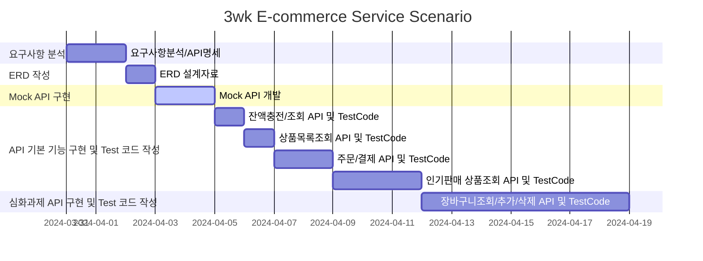

## Environment
- Spring Boot 3.2.4
- Java 17
- Junit & AssertJ
- H2 DB
- JPA
- gradle

## [프로젝트 개요](https://www.notion.so/teamsparta/e-afea5b4f98f64f60a093185877db151c?pvs=4)
- `e-커머스 상품 주문 서비스`를 구현해 봅니다.
- 상품 주문에 필요한 메뉴 정보들을 구성하고 조회가 가능해야 합니다.
- 사용자는 상품을 여러개 선택해 주문할 수 있고, 미리 충전한 잔액을 이용합니다.
- 상품 주문 내역을 통해 판매량이 가장 높은 상품을 추천합니다.

## Requirements
- 아래 4가지 API 를 구현합니다.
    - 잔액 충전 / 조회 API
    - 상품 조회 API
    - 주문 / 결제 API
    - 인기 판매 상품 조회 API
- 각 기능 및 제약사항에 대해 단위 테스트를 반드시 하나 이상 작성하도록 합니다.
- 다수의 인스턴스로 어플리케이션이 동작하더라도 기능에 문제가 없도록 작성하도록 합니다.
- 동시성 이슈를 고려하여 구현합니다.
- 재고 관리에 문제 없도록 구현합니다.

## API Specs
### 기본과제
1️⃣ **잔액 충전 / 조회 API**
- 결제에 사용될 금액을 충전하는 API 를 작성합니다.
- 사용자 식별자 및 충전할 금액을 받아 잔액을 충전합니다.
- 사용자 식별자를 통해 해당 사용자의 잔액을 조회합니다.

2️⃣ **상품 조회 API**
- 상품 정보 ( ID, 이름, 가격, 잔여수량 ) 을 조회하는 API 를 작성합니다.
- 조회시점의 상품별 잔여수량이 정확하면 좋습니다.

3️⃣ **주요** **주문 / 결제 API**
- 사용자 식별자와 (상품 ID, 수량) 목록을 입력받아 주문하고 결제를 수행하는 API 를 작성합니다.
- 결제는 기 충전된 잔액을 기반으로 수행하며 성공할 시 잔액을 차감해야 합니다.
- 데이터 분석을 위해 결제 성공 시에 실시간으로 주문 정보를 데이터 플랫폼에 전송해야 합니다. ( 데이터 플랫폼이 어플리케이션 `외부` 라는 가정만 지켜 작업해 주시면 됩니다 )

> 데이터 플랫폼으로의 전송 기능은 Mock API, Fake Module 등 다양한 방법으로 접근해 봅니다.
4️⃣ **상위 상품 조회 API**

- 최근 3일간 가장 많이 팔린 상위 5개 상품 정보를 제공하는 API 를 작성합니다.
- 통계 정보를 다루기 위한 기술적 고민을 충분히 해보도록 합니다.

---

### 심화 과제
5️⃣ 장바구니 기능
- 사용자는 구매 이전에 관심 있는 상품들을 장바구니에 적재할 수 있습니다.
- 이 기능을 제공하기 위해 `장바구니에 상품 추가/삭제` API 와 `장바구니 조회` API 가 필요합니다.
- 위 두 기능을 제공하기 위해 어떤 요구사항의 비즈니스 로직을 설계해야할 지 고민해 봅니다.

<aside>
💡 KEY POINT
</aside>
- 동시에 여러 주문이 들어올 경우, 유저의 보유 잔고에 대한 처리가 정확해야 합니다.
- 각 상품의 재고 관리가 정상적으로 이루어져 잘못된 주문이 발생하지 않도록 해야 합니다.


## Milestone
초안 : [hh_3wk_MileStone.pdf](https://github.com/K-J-HYEON/hh_3wk_ecommerce/files/14816387/hh_3wk_MileStone.pdf)
##
수정
##



## [API 명세](https://www.notion.so/API-Spec-03d6bae05df54779a35530352d778071?pvs=4)

<details>
  <summary>잔액충전</summary>
    
- Request:
    - Method: POST
    - URL: /api/point/charge/{userId}
    - Headers:
        - Content-Type: application/json


- Body
  ```json
        {
            "point": 100
        }
  ```
  
- Response:
    - 200 OK: 성공적으로 잔액 충전
        ```json
            {
                "code": "OK",
                "point": 100
            }
        ```
        
    - 400 Bad Request: 충전 금액이 알맞지 않은 경우
        ```json
        {
            "code": "BAD_REQUEST",
            "message": "Requested Point is not appropriate"
        }
        ```
    - 404 User Not Found: 유저 정보가 없는 경우
        ```json
        {
            "code": "NOT_FOUND_USER",
            "message": "User Information is missing."
        }
        ```
</details>


<details>
  <summary><b>잔액조회</b></summary>
    
- Request:
    - Method: GET
    - URL: /api/point/{userId}
    - Headers:
      - Content-Type: application/json
        
- Response:
    - 200 OK: 성공적으로 잔액 조회
    ```json
            {
                "code": "OK",
                "point": 100
            }
    ```

    - 404 User Not Found : 유저 정보가 없는 경우
    ```json
        {
            "code": "NOT_FOUND_USER",
            "message": "User information is missing."
        }
    ```
</details>


<details>
    <summary><b>상품 목록 조회</b></summary>

- Request:
    - Method: GET
    - URL: /api/product/{productId}
    - Headers:
      - Content-Type: application/json
    
- Response:
    - 200 OK: 성공적으로 조회
        ```json
    
            {
                "code": "OK",
                "products": [
                    {
                        "productId": 1,
                        "productName": "테스트 상품1",
                        "price": 1000,
                        "count": 1
                    }
                ]
            }
        ```
</details>


<details>
    <summary><b>인기 판매 상품 조회</b></summary>
    
- Request
    - Method: GET
    - URL: /api/product/best
    - Headers:
      - Content-Type: application/json

- Response
    - 200 OK: 성공적으로 조회
        ```json
        {
            "code": "OK",
            "products": [
                {
                    "productId": 1,
                    "name": "테스트상품1",
                    "price": 1000,
                    "stock": 10,
                    "threeDaysCount": "3",
                    "rank": "1",

                    "productId": 2,
                    "name": "테스트상품2",
                    "price": 1000,
                    "stock": 10,
                    "threeDaysCount": "3",
                    "rank": "2",


                    "productId": 4,
                    "name": "테스트상품4",
                    "price": 1000,
                    "stock": 10,
                    "threeDaysCount": "3",
                    "rank": "3",


                    "productId": 3,
                    "name": "테스트상품3",
                    "price": 1000,
                    "stock": 10,
                    "threeDaysCount": "3",
                    "rank": "4",


                    "productId": 6,
                    "name": "테스트상품6",
                    "price": 1000,
                    "stock": 10,
                    "threeDaysCount": "3",
                    "rank": "5"
        
                }
            ]
        }
    ```
</details>


<details>
    <summary><b>주문 결제</b></summary>
    
- Request
    - Method: POST
    - URL: /order/{orderId}/{userId}
    - Headers:
      - Content-Type: application/json
    
- Body:
  ```json
    
        [
            {
                "productId": 1,
                "productName": "sample1",
                "count": 1,
                "price": 1000
        
            },
        
            {
                "productId": 2,
                "productName": "sample2",
                "count": 2,
                "price": 2000
            }
        ]
  ```
  
- Response
    - 200 OK: 성공적으로 주문 및 결제
        ```json
            {
                "userId": 1,
                "orderId": 1,
                "paymentId": 1,
                "point": 10000,
                "paymentPoint": 3000,
                "aftePoint": 7000,
                "order":
                [
                    {
                        "productId": 1,
                        "productName": "sample1",
                        "count": 1,
                        "price": 1000
        
                    },
        
                    {
                        "productId": 2,
                        "productName": "sample2",
                        "count": 2,
                        "price": 2000
                    }
                ]
            }
        ```
    - 400 Bad Request: 주문 상품이 적절하지 않은 경우
        ```json
        {
            "code": "BAD_REQUEST",
            "message": "Order Product List is not valid"
        }
        ```
    - 404 Not Found User: 유저 정보가 없는 경우
        ```json
        {
            "code": "NOT_FOUND_USER",
            "message": "User Information is missing"
        }
        ```
    - 404 Not Found Product: 상품 정보가 없는 경우
        ```json
        {
            "code": "NOT_FOUND_PRODUCT",
            "message": "Product Information is not found"
        }
        ```
    - 404 Bad Request: 포인트가 없는 경우
        ```json
        {
            "code": "NOT_FOUND_POINT",
            "message": "Point is not found"
        }
        ```
</details>


<details>
  <summary>장바구니 상품 추가</summary>
    
- Request
    - Method: POST
    - URL: /api/cart/{cartId}/user/{userId}
    - Headers:
        - Content-Type: application/json
    
- Body:
    ```json
    
        [
            {
                "productId": 1,
                "productName": "sample1",
                "count": 1,
                "price": 1000
            },
    
            {
                "productId": 2,
                "productName": "sample2",
                "count": 1,
                "price": 2000
            }
        ]
    ```    
- Response
    - 200 OK: 성공적으로 추가
        ```json
        {
            "code": "OK",
            "cartId" : 1,
            "userId" : 1,
            "totalPrice" : 3000,
            "cart":
            [
                {
                    "productId" : 1,
                    "productName" : "sample1",
                    "count" : 1,
                    "price" : 1000
                },
        
                {
                    "productId" : 2,
                    "productName" : "sample2",
                    "count" : 1,
                    "price" : 2000
                }
            ]
        }
        ```
</details>


<details>
  <summary>장바구니 상품 삭제</summary>
    
- Request
    - Method:DELETE
    - URL: /api/cart/{cartId}/user/{userId}
    - Headers:
        - Content-Type: application/json
    
- Body
  ```json
        [
            {
                "productId": 3,
                "productName": "sample3",
                "count": 3,
                "price": 3000
            },
  
            {
                "productId": 4,
                "productName": "sample4",
                "count": 4,
                "price": 4000
            }
        ]
  ```

  
- Response
    - 200 OK: 성공적으로 삭제
      ```json
          {
                "code": "OK",
            	  "cartId" : 1,
                "userId" : 1,
            	  "totalPrice" : 25000,
            	  "cart":
                	[
                		{
                			"productId" : 3,
                			"productName" : "sample3",
                			"count" : 3,
                			"price" : 3000
                		},
      
                		{
                			"productId" : 4,
                			"productName" : "sample4",
                			"count" : 4,
                			"price" : 4000
                		}
                	]
            }
        ```
</details>


<details>
  <summary>장바구니 목록 조회</summary>

- Request
    - Method: GET
    - URL: /api/cart/{cartId}/user/{userId}
    - Headers:
        - Content-Type: application/json
- Response
    - 200 OK: 성공적으로 조회
        ```json
            {
                "code": "OK",
                "cartId": 1,
                "userId": 1,
                "totalPrice": 5000,
                "cart": [
                    {
                        "productId": 1,
                        "productName": "sample1",
                        "count": 3,
                        "price": 1000
                    },
        
                    {
                        "productId": 2,
                        "productName": "sample2",
                        "count": 2,
                        "price": 2000
                    }
                ]
            }
        ```
</details>


## [Mock API 작성](https://www.notion.so/Mock-API-8987218a4185421f942fab4da77f858a?pvs=4) / [링크](https://documenter.getpostman.com/view/22802100/2sA35LUynx#intro)


## 시퀀스 다이어그램


## 플로우 차트


## ERD 초안

