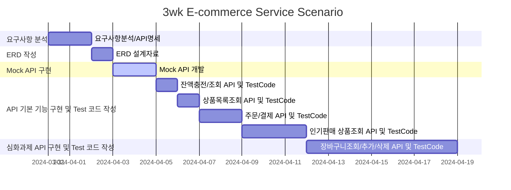

## 개발 환경
- Java 17
- Junit & AssertJ
- H2 DataBase
- JPA
- gradle

## Milestone
초안 : [hh_3wk_MileStone.pdf](https://github.com/K-J-HYEON/hh_3wk_ecommerce/files/14816387/hh_3wk_MileStone.pdf)
##
수정
##
